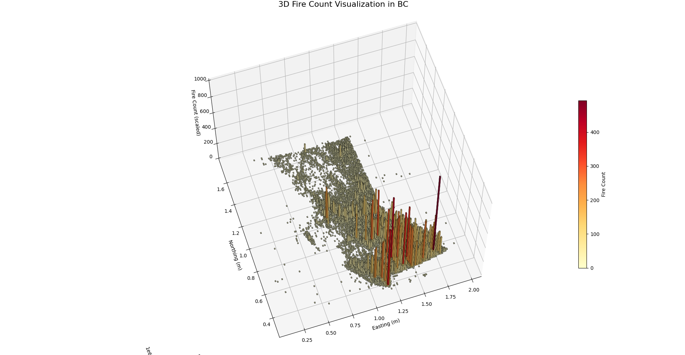

# 🔥 BC Wildfire Predictor 🔥

Wildfire Predictor is a Python project designed to analyze wildfire data in British Columbia, preprocess inputs, train predictive models, and visualize wildfire occurrences. This README covers the essential information you need to get started with the project.



## Installation

1. **Python**  
   Ensure that [Python](https://www.python.org/) is installed on your system.

2. **Virtual Environment**  
   Create and activate a virtual environment:
   ```sh
   python -m venv .venv
   source .venv/bin/activate  # On Windows, use ".venv\Scripts\activate"
   ```
   
2. **Dependencies**
   Install the required packages:
   ```sh
   pip install -r requirements.txt
   ```
## Data

The data required for the project is located in the [data](https://github.com/coltonBlackwell/Wildfire-Predictor/tree/main/data) directory.

- CANADA_WILDFIRES.csv: Contains records of wildfires.
- fire_grid_counts.csv: Provides grid-based wilfdire counts.
- grid_cell_features.csv: Lists features for each grid cell.
- Processed data can be found in the [processed](https://github.com/coltonBlackwell/Wildfire-Predictor/tree/main/data/processed) directory.

## Documentation

For detailed information about the dataset and its usage, refer to the [dataset_guide.md](https://github.com/coltonBlackwell/Wildfire-Predictor/blob/main/docs/dataset_quide.md) file

## Testing

Unit tests are provided in the [tests](https://github.com/coltonBlackwell/Wildfire-Predictor/tree/main/tests) directory.

run all tests using: 

```sh
   pytest
```
or test modules specifically using: 

```sh
   pytest [test_filename.py]
```

## License

This project is licensed under the terms of the [LICENSE](https://github.com/coltonBlackwell/Wildfire-Predictor/blob/main/LICENSE) file.

## Learn More

▶️ Check it out on [Youtube](https://www.youtube.com/watch?v=yd_FXZ6rbYc)! \
🧑‍💻 Read more about it on my [website](https://coltonblackwell.github.io/wildfire.html)!

